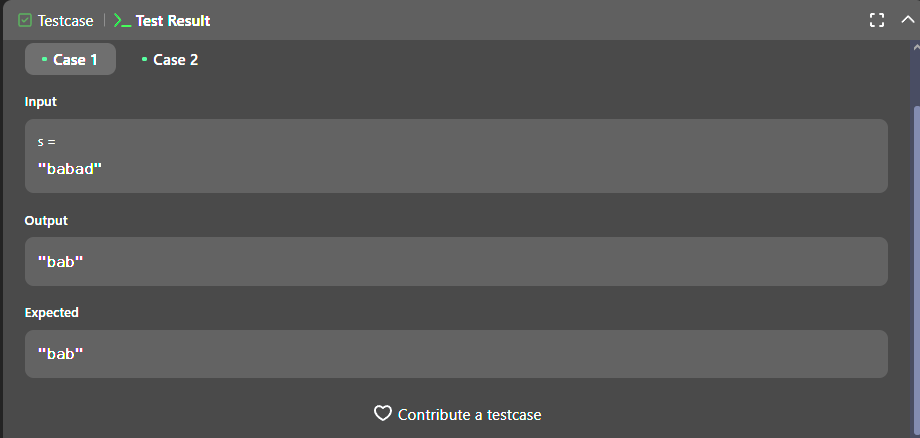
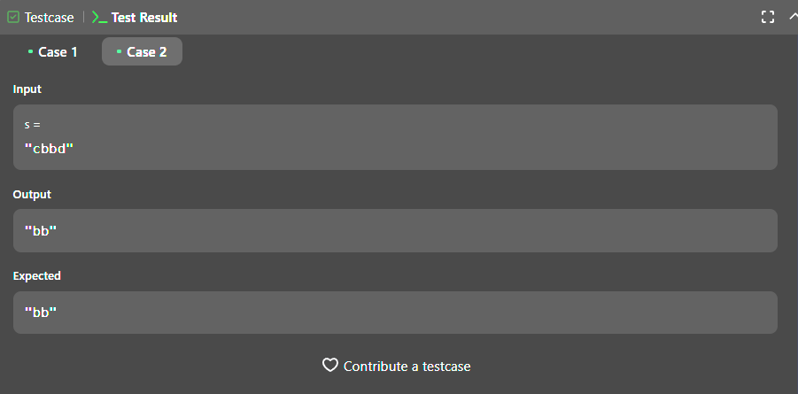
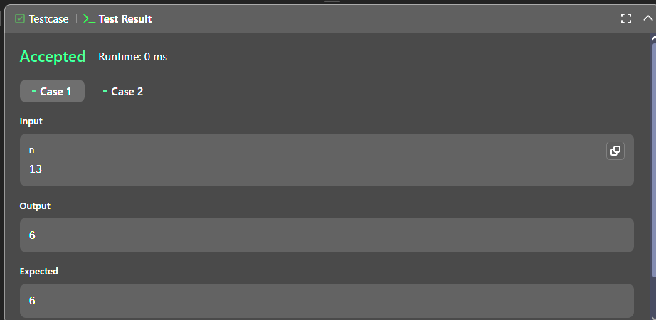
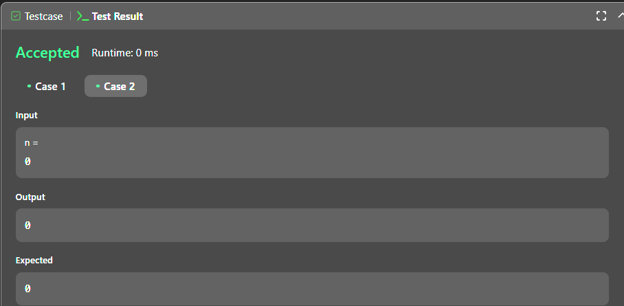

# Execícios do Leetcode

**Número da Lista**: 5 

**Conteúdo da Disciplina**: Programação Dinâmcia 

## Alunos

| Matrícula | Aluno                     |
| --------- | ------------------------- |
| 200054333 | Arthur Gabriel Lima Gomes |
| 211061350 | Alexandre de Santana Beck |

## Sobre

Este projeto tem como objetivo resolver questões do [LeetCode](https://leetcode.com/problemset/?topicSlugs=dynamic-programming&page=1) sobre Programação Dinâmica utilizando a linguagem de programação JavaScript. Abaixo, estão listadas as questões selecionadas, com seus respectivos níveis de dificuldade e vídeos explicativos da resolução.

## Questões

| Nome                                                                                                         | Nível   |
| ------------------------------------------------------------------------------------------------------------ | ------- |
| [5. Longest Palindromic Substring](https://leetcode.com/problems/longest-palindromic-substring/description/) | Médio   |
| [10. Regular Expression Matching](https://leetcode.com/problems/regular-expression-matching/description/)    | Difícil |
| [233. Number of Digit One](https://leetcode.com/problems/number-of-digit-one/description/)                   | Difícil |

## Video

[Vídeo]()

## Screenshots

### [5. Longest Palindromic Substring](https://leetcode.com/problems/longest-palindromic-substring/description/)

**Caso 1:**

**Caso 2:**

### [233. Number of Digit One](https://leetcode.com/problems/number-of-digit-one/description//)

**Caso 1:**

**Caso 2:**

## Uso

Para executar as soluções, você pode colar o código diretamente no LeetCode ou criar casos de teste na função `main` do arquivo.
